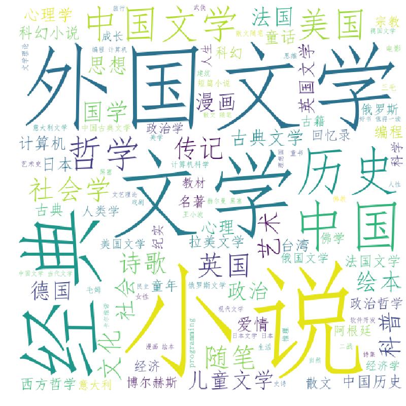

# DouBan_book_spider
This is beautiful-soup based scraper for douban book 
We mainly scrap the book list with score>9.0.

# Environment
    matplotlib
    pandas
    numpy
    wordcloud
    bs4
    
# How to use
1. Scrap douban list and save to a csv(you can add your needed 
Field into the code)
       
       
  
    python Douban_annul_book_spider.py

2. Cound word and tranferm it into word cloud

    python analysis.py

